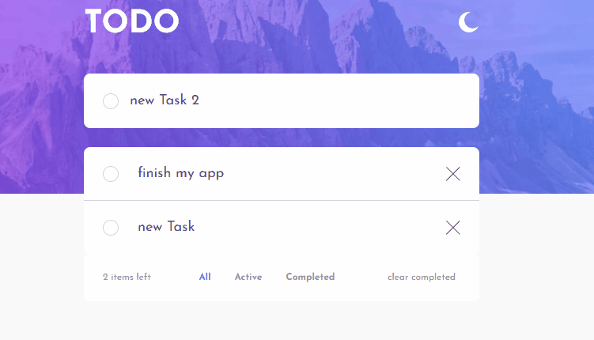

# Frontend Mentor - TODO APP

## The challenge

The challenge is to build out [this tod app](https://www.frontendmentor.io/challenges/todo-app-Su1_KokOW) and get it looking as close to the design as possible.

- Figma and Sketch files are provided
- Optimized assets are found in the `public/images` folder.
- There is also a `style-guide.md` file, which contains the information such as color palette and fonts.

Minimum requirements:
-View the optimal layout for the app depending on their device's screen size
-See hover states for all interactive elements on the page
-Add new todos to the list
-Mark todos as complete
-Delete todos from the list
-Filter by all/active/complete todos
-Clear all completed todos
-Toggle light and dark mode

Bonus:
I decided to go a little far and add some features:

- Check system option to show light / dark mode first time you open the app.
- Task are saved in localStorage
- Theme chosen is saved in localStorage
- Drag and Drop for task.

## Tools I used

- React
- Vite
- Styled-Components
- Grid and Flexbox
- Figma
- [reat-beautiful-dnd library](https://github.com/atlassian/react-beautiful-dnd)
- [uuid](https://github.com/uuidjs/uuid)

## Learning outcomes

Lot of learnings in this project. I'm going to do a recap:

### Thinking in React

One of the most complicated things about React is start to think about components, how many of them and how to interact between them.
I spent some time at the beginning of the project thinking how to do it.
[This article](https://reactjs.org/docs/thinking-in-react.html#gatsby-focus-wrapper) from react docs is amazing.

### Vite and styled components

It was my first time with Vite and took me a little longer to make work vite with styled components. Specially for debugging is very useful for me to show me component and name of the file where it is the class generated.
You can check in vite.config.js how I solved it.

### Visually Hidden Component

I use a component for accesibility issues. All icons that has no text and can perform an action (change theme and delete a task ) can be readed by screen readers.

### react-beautiful-dnd

I learnt the basics of this amazing library.

### CSS learnings

I learnt or review some stuff:

- SVG and viewBox
- focus-visible / focus-whithin
- How to do a linear gradient border
- user-select property
- Create a custom checkbox
- Light / Dark theme only with custom CSS properties.

## Solution preview

  

